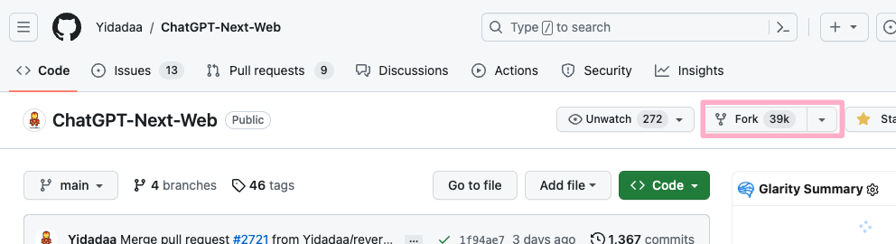
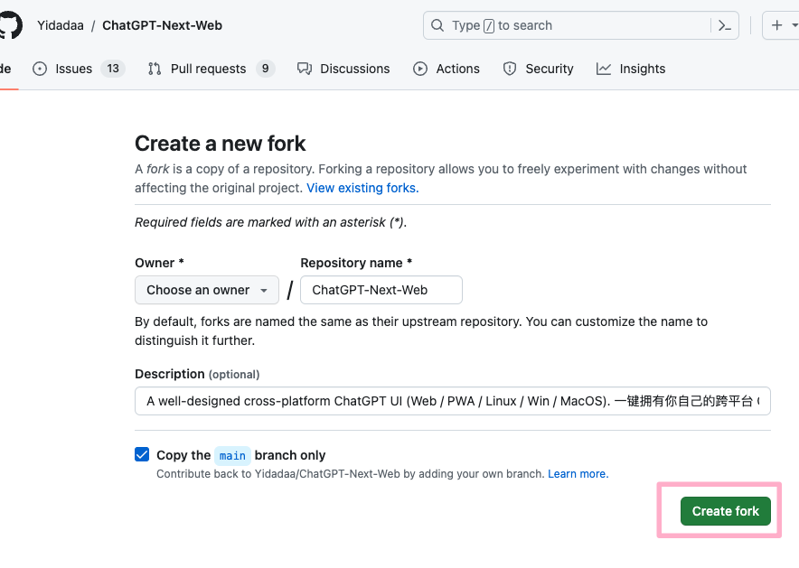
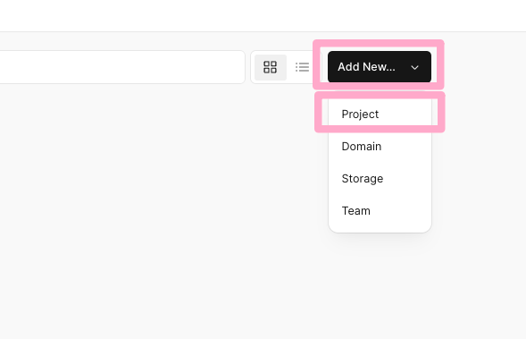
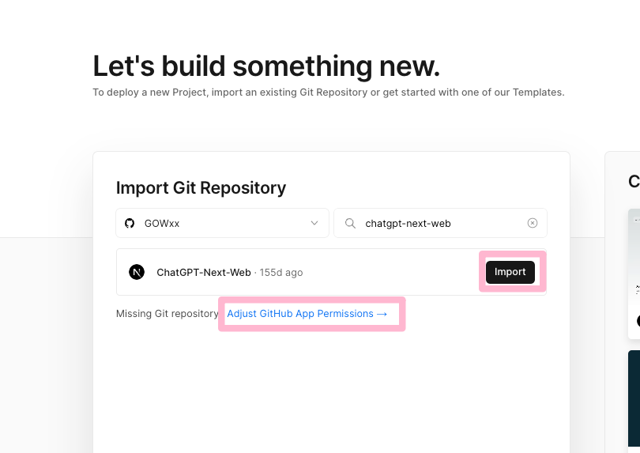
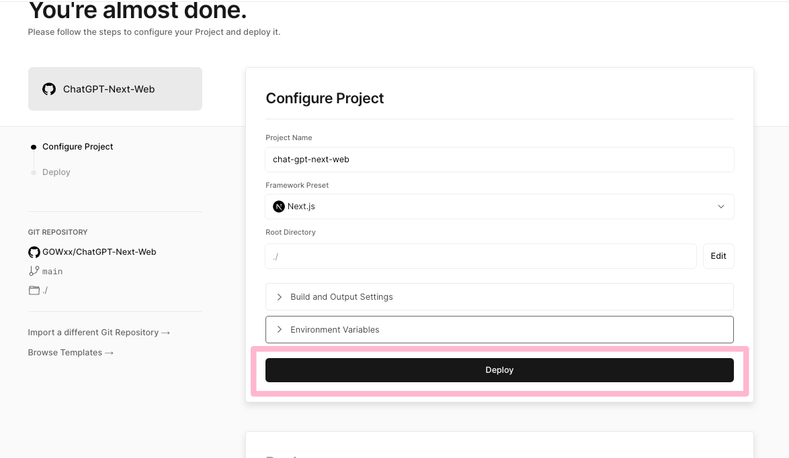
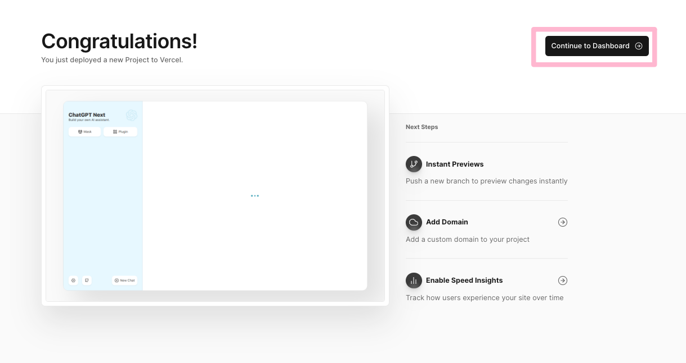
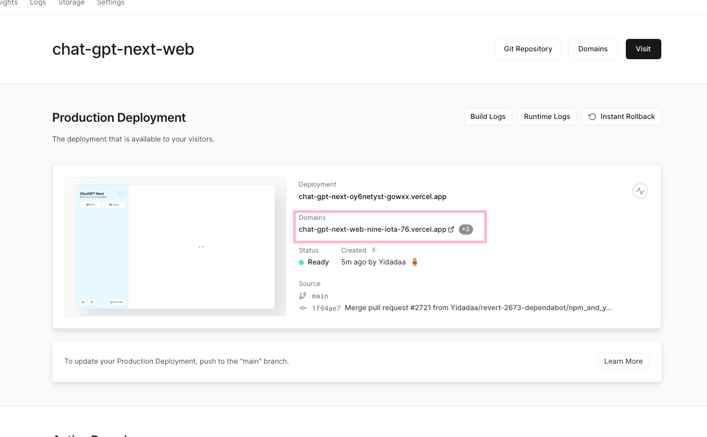

# 快速构建自己的 ChatGPT

教程目的：通过 vercel、ChatGPT-Next-Web、转发 API 快速构建自己的ChatGPT。

**ChatGPT-Next-Web** 负责提供 ChatGPT 界面，包括一些展示、交互和配置，**Vercel** 用来托管运行这个界面。如果在国内使用 openAI 原生API，付费和使用都比较困难，所以需要用 **转发API** 来提供易于付费和使用的、价格便宜的 API。

## 名词介绍

**Vercel**

Vercel 是一个强大的静态网站托管平台，为开发者提供了简单、快速和可扩展的部署解决方案，使其能够专注于构建出色的Web应用程序。

**ChatGPT-Next-Web**

ChatGPT-Next-Web 是一个基于 OpenAI 的 ChatGPT 模型构建的 Web 应用程序。

**转发API**

转发 API（Forwarding API）是一种将用户请求转发给另一个 API 的方式。

## 前期准备

注册 [GitHub](https://github.com/) 账号，并用 GitHub 账号在 [Vercel](https://vercel.com/) 登陆。

## 实际操作

### 一、Fork 项目

打开 [ChatGPT-Next-Web](https://github.com/Yidadaa/ChatGPT-Next-Web) 项目，点击 `Fork` 按钮，如非必要不用更改任何信息，点击 `Create fork` 按钮。

这样就获得了自己的 ChatGPT-Next-Web 项目。

因为 **ChatGPT-Next-Web** 项目配置了 github actions，其中一个任务可以自动拉取更新，所以理想情况是可以 fork 的项目自动跟着上游项目更新。

### 二、Vercel 部署

打开 **Vercel** 在 Overview 面板点击 `Add New` 按钮，在下拉菜单中点击 `Project` 。

在下一个页面中选择 **ChatGPT-Next-Web** 项目，如果找不到那么点击 **Adjust GitHub App Permissions**，在新弹窗页面里调整下权限。

点击 `Import` 按钮。

在下一步页面中，什么设置都不用更改，直接点击 `Deploy` 按钮。

等待大约2分钟，即可部署完成，点击 `Continue to Dashboard` 按钮。

在 **dashboard** 界面即可看到项目状态，这里我们可以点击域名 `Domains` 访问部署成功的项目。

### 三、购买 转发API

### 四、修改域名和环境变量

1. 域名方便记录使用
2. 一定设置授权码
3. 设置 base_url
4. 重新部署才生效

### 五、常见问题及解释

1. 转发API
2. 授权码 - 盗用
3. github actions 更新失败