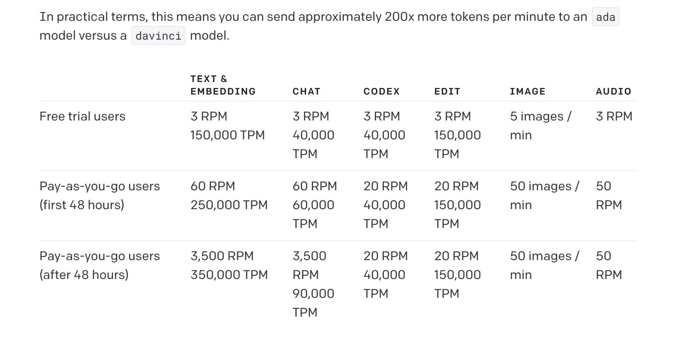

# 基于 GPT-3.5 的 Epub 翻译工具 bilingual_book_maker

## 一、介绍

[bilingual_book_maker](https://github.com/yihong0618/bilingual_book_maker) 是一个 AI 翻译工具，使用 ChatGPT 帮助用户制作多语言版本的 epub/txt 文件和图书。

2023.3.22 更新：
- 已经支持多种翻译 API 了，例如 DeepL、Google、彩云 等等。
-  `--batch_size` 参数可用了，不过目前只对 txt 生效。
- 发包了，支持 `**pip install bbook_maker**` 安装。

### 使用 bilingual_book_maker 需要准备

1. [openai API key]([https://platform.openai.com/account/api-keys](https://platform.openai.com/account/api-keys))
2. epub/txt books
3. 能正常联网的环境或 proxy
4. python3.8 +

### 逐项解释并说明重点

#### openai API key
  1. openai API key 是在 [openai platform](https://platform.openai.com/login) 注册账号并登陆，在 [api-keys](https://platform.openai.com/account/api-keys) 界面点击 `+ Create new secret key` 按钮生成一个的 API key，通过此 key 可以调用 openai API，注意在点击按钮后弹窗中出现的 key 只会出现一次，保存好。
  2. 在 [usage](https://platform.openai.com/account/usage) 界面可以看使用量。
  3. 有 [rate-limits](https://platform.openai.com/docs/guides/rate-limits)，以 **RPM** (requests per minute) 和 **TPM** (tokens per minute) 作为限制指标，体验金账号就是 Free trial Users, 如果用着用着有 api 调用失败的时候可能是触发了 rate-limits, 绑定了支付信息就是 Pay-as-you-go users，可以看到 RPM 的限额高很多。
	  

#### epub/txt books

想要翻译的 epub 或 txt 书籍文件，在 [bilingual_book_maker](https://github.com/yihong0618/bilingual_book_maker) 项目有 [test_books](https://github.com/yihong0618/bilingual_book_maker/tree/main/test_books) 文件夹里的书籍供测试。

#### 联网和 proxy

按照 openai 的政策，在中国的 ip 是不允许调用 API 的，包括香港地区的 ip，否则容易导致 API 或者账号 ban 掉，虽然事实上（2023年3月）是可以在 香港 ip 调用 API 的，但存在的风险就是会被 ban 。

#### python3.8 +

用 [pyenv](https://github.com/pyenv/pyenv) 管理 python 版本，还可以针对项目配置版本，很方便。

## 二、使用

### 调用方法

1. 安装期望的 python 版本
2. 克隆项目到本地，进入项目目录
3. `pip install -r requirements.txt`
4. `python3 make_book.py --book_name 'test_books/animal_farm.epub' --openai_key sk-XXXXX`
5. 更多说明参考 [使用说明](https://github.com/yihong0618/bilingual_book_maker/blob/main/README-CN.md#%E4%BD%BF%E7%94%A8)

### 参数说明
| API说明                      | 命令                                                          | 可用参数实例                                    |
| ---------------------------- | ------------------------------------------------------------- | ----------------------------------------------- |
| 安装依赖                     | pip install -r requirements.txt 或 pip install -U bbook_maker |                                                 |
| 指定 OpenAI API key          | --openai_key                                                  | --openai_key xxx                                |
| 指定多个 OpenAI API key      | 用英文逗号分隔                                                | --openai_key xxx,xxx,xxx                        |
| 使用环境变量                 | BMM_OPENAI_API_KEY                                            |                                                 |
| 指定测试电子书路径           |                                                               | test_books/animal_farm.epub                     |
| 指定模型                     | --model                                                  | --model gpt3                                    |
| 使用 DeepL 进行翻译          | --model deepl --deepl_key ${deepl_key}                        | --model deepl --deepl_key xxx                   |
| 使用 Google 进行翻译         | --model google                                                |                                                 |
| 使用彩云进行翻译             | --model caiyun --caiyun_key ${caiyun_key}                     | --model caiyun --caiyun_key xxx                 |
| 使用 --test 命令             | --test                                                        |                                                 |
| 指定目标语言                 | --language "language_name"                               | --language "Simplified Chinese"                 |
| 查找可用的目标语言           | python make_book.py --help                                    |                                                 |
| 使用代理                     | --proxy proxy_address                                 | --proxy http://127.0.0.1:7890                   |
| 手动中断后，加入命令继续执行 | --resume                                                      |                                                 |
| 指定需要翻译的标签           | --translate-tags ${tag name} 多个可用英文逗号分隔                              | --translate-tags h1,h2,h3,p,div                 |
| 指定电子阅读器类型           | --book_from                                                   |                                                 |
| 指定挂载点                   | --device_path                                                 |                                                 |
| 替换 api_base                | --api_base ${url}                                             | --api_base https://xxxx/v1                      |
| 翻译完生成的双语书名         |                                                               | ${book_name}_bilingual.epub                     |
| 错误中断生成的书名           |                                                               | ${book_name}_bilingual_temp.epub                |
| 翻译无标签字符串             | --allow_navigable_strings                                     |                                                 |
| 调整 prompt                  | --prompt                                                      | --prompt "Translate {text} to {language}"       |
| 指定批量翻译的行数           | --batch_size                                                  | --batch_size 10 (默认行数为10，目前只对txt生效) |

### 重要参数

参数 `--batch_size`

此参数可以开启批量处理，实测可以将翻译时间缩短数倍，但我目前仅在 apple silicon macos 平台跑通，centos 目前(2023.3.22)无法跑通。

可以关注以下两个相关的 issues 和 pr：

- [请教作者如何能翻译提速 #134](https://github.com/yihong0618/bilingual_book_maker/issues/134)
- [support batch processing #62](https://github.com/yihong0618/bilingual_book_maker/pull/62)

使用 `--batch_size` 参数：
原项目的 [PR#62](https://github.com/yihong0618/bilingual_book_maker/pull/62) 兼容性问题没处理，还没合并进 `main` 分支，于是我从上游仓库[bilingual_book_maker](https://github.com/yihong0618/bilingual_book_maker) fork 了项目并创建 [合并了 PR#62 的分支](https://github.com/GOWxx/bilingual_book_maker/tree/test_batch_processing)，可以先用这个分支的代码。

## 三、实测

《哈利波特》七部完整版共 140 万左右的英文单词，开启 `--batch_size` 参数翻译成双语版本用时大概是 2.5 小时。
