# 快速构建自己的 ChatGPT

教程目的：通过 vercel、ChatGPT-Next-Web、转发 API 快速构建自己的ChatGPT。

**ChatGPT-Next-Web** 负责提供 ChatGPT 界面，包括一些展示、交互和配置，**Vercel** 用来托管运行这个界面。如果在国内使用 openAI 原生API，付费和使用都比较困难，所以需要用 **转发API** 来提供易于付费和使用的、价格便宜的 API。

## 名词介绍 

**Vercel**

Vercel 是一个强大的静态网站托管平台，为开发者提供了简单、快速和可扩展的部署解决方案，使其能够专注于构建出色的Web应用程序。

**ChatGPT-Next-Web**

ChatGPT-Next-Web 是一个基于 OpenAI 的 ChatGPT 模型构建的 Web 应用程序。

**转发API**

转发 API（Forwarding API）是一种将用户请求转发给另一个 API 的方式。

## 前期准备

注册 [GitHub](https://github.com/) 账号，并用 GitHub 账号在 [Vercel](https://vercel.com/) 登陆。

## 实际操作

### 一、Fork GitHub 项目

打开 [ChatGPT-Next-Web](https://github.com/Yidadaa/ChatGPT-Next-Web) 项目，点击 `Fork` 按钮，如非必要不用更改任何信息，点击 `Create fork` 按钮。

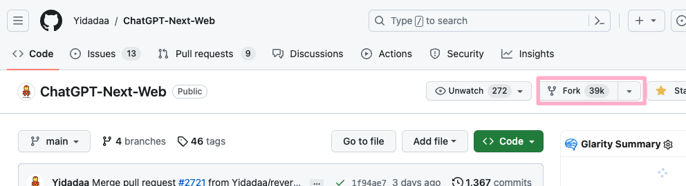

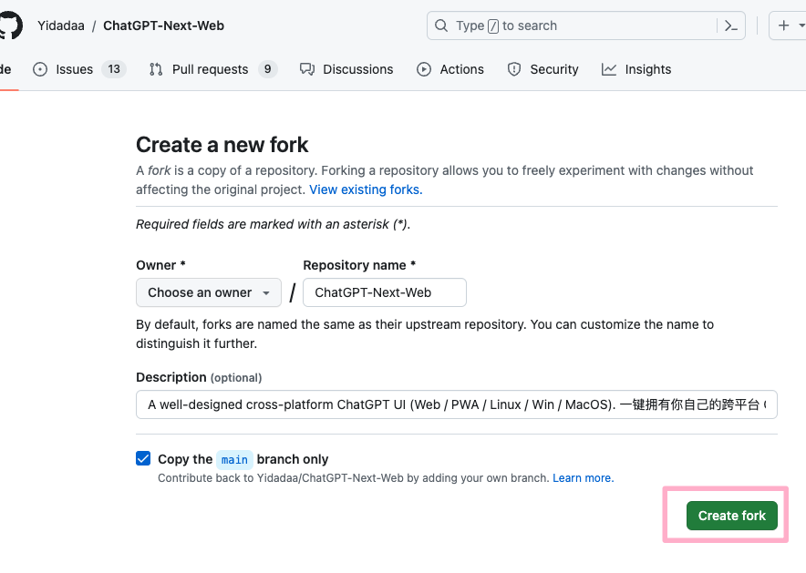

这样就获得了自己的 ChatGPT-Next-Web 项目。

因为 **ChatGPT-Next-Web** 项目配置了 github actions，其中一个任务可以自动拉取更新，所以理想情况是可以 fork 的项目自动跟着上游项目更新。

### 二、Vercel 部署项目

打开 **Vercel** 在 Overview 面板点击 `Add New` 按钮，在下拉菜单中点击 `Project` 。

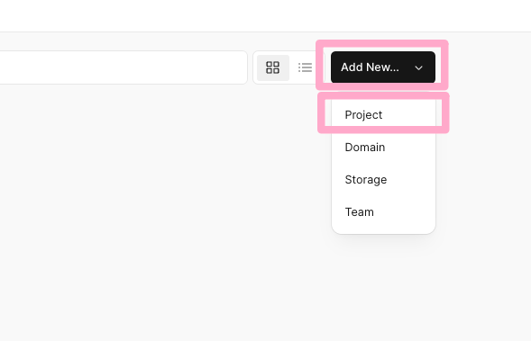

在下一个页面中选择 **ChatGPT-Next-Web** 项目，如果找不到那么点击 **Adjust GitHub App Permissions**，在新弹窗页面里调整下权限。

点击 `Import` 按钮。

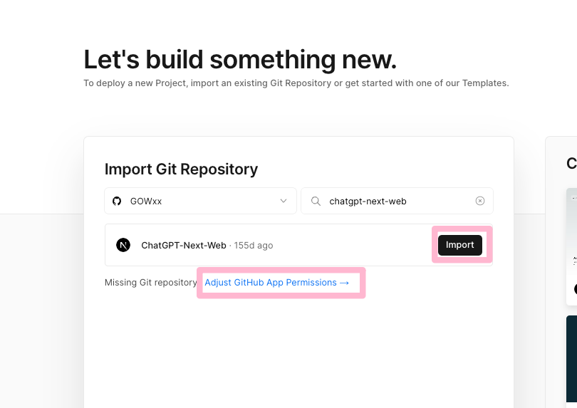

在下一步页面中，什么设置都不用更改，直接点击 `Deploy` 按钮。

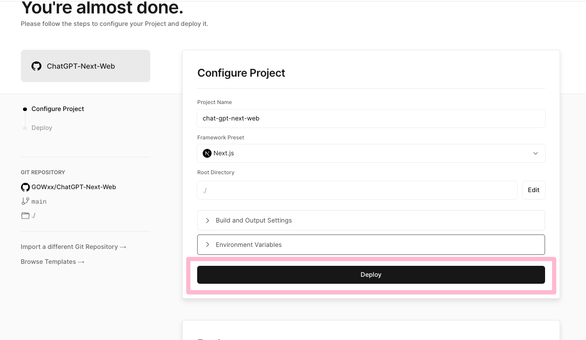

等待大约2分钟，即可部署完成，点击 `Continue to Dashboard` 按钮。

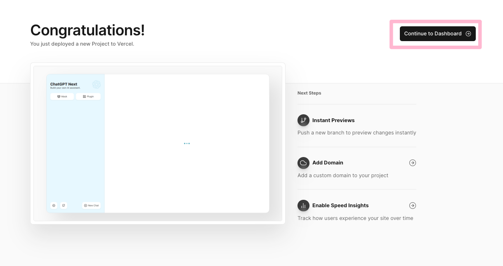

在 **dashboard** 界面即可看到项目状态，这里我们可以点击域名 `Domains` 访问部署成功的项目。

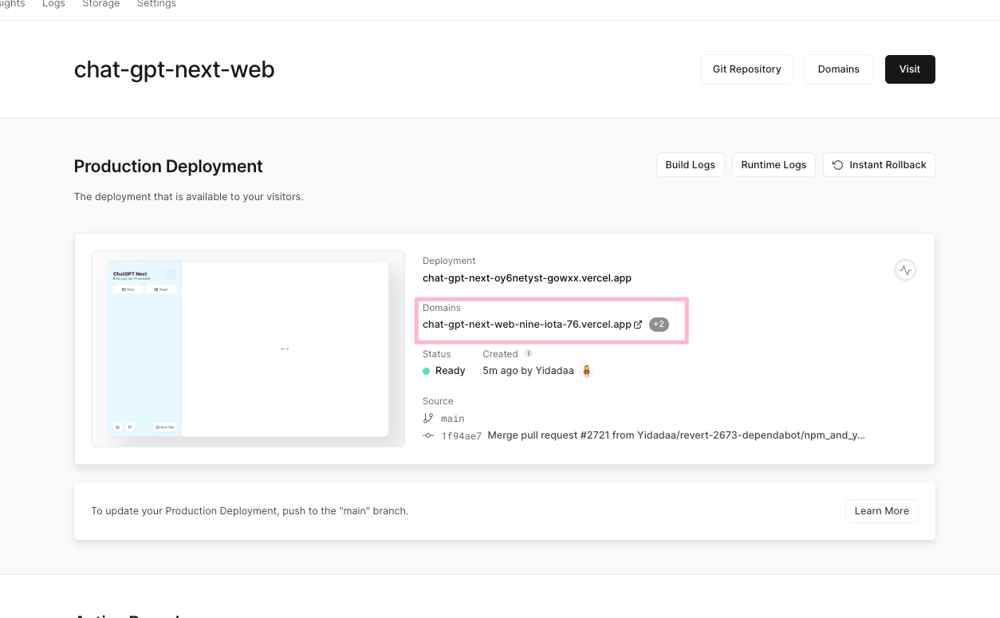

到此我们的 ChatGPT 项目成功部署。

### 三、购买 转发API

一般 **转发API** 是要比 openai API 便宜的，具体不解释了。
经过多方比对，我目前是在 peiqi 买的，(3.5相当于官方价格除7，4相当于官方价格83折)，各位有更便宜优质的也欢迎推荐给我。

打开 [peiqishop](https://peiqishop.me/) 购买 **GPT4&3.5转发API**，初次购买建议买最少量的，这里以 30 元的为例。

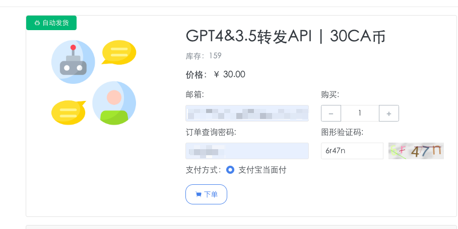

#### 信息说明

在商品页说明可以看到一些重要信息，**费用**、**限速**、**请求地址/base url**、**查询地址** 等。

**费用** 即使用费用，计费方式与 oepnai API 相同，只是价格不同。

**限速** 即请求次数限制，参照 openai 官方文档说明 [Rate limits](https://platform.openai.com/docs/guides/rate-limits/rate-limits)，peiqishop 的 API 是 “3.5无限速，4.0 和 plus 限速 100r/5min/key”。

**请求地址** 是 `api.chatanywhere.cn` ，这个我们一会儿要用。

**查询地址** 是用来查询 api key 消耗的，之后在使用中对于自己的消耗有个把握。

#### 购买 key

购买后会获得一个 **key**，结构是 `sk-***`，把这个保存好。一会儿需要用到。

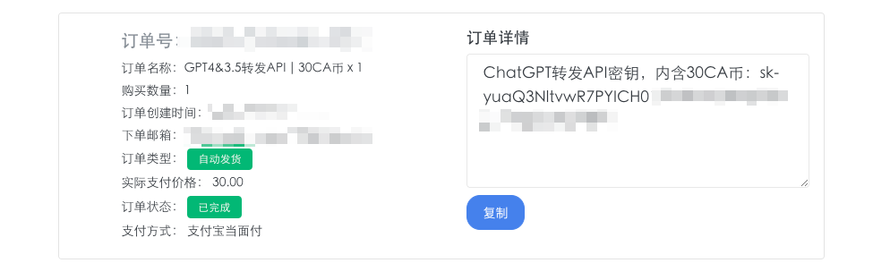

到此我们的 **转发API** 已经搞定。

> 不同的 **转发API** 服务商的 **请求地址** 、**key** 等可能不同，看各自的说明。

### 四、Vercel 项目配置环境变量

我们要配置环境变量，使其适合 **转发API**，而且

**必须设置授权码！**
**必须设置授权码！**
**必须设置授权码！**

不然会有 API 被盗用的风险！

> **警告**：请务必将密码的位数设置得足够长，最好 7 位以上，否则[会被爆破](https://github.com/Yidadaa/ChatGPT-Next-Web/issues/518)。

也可以把域名配置一下，方便后续访问使用。

#### 1. 配置环境变量

在 Vercel 项目界面，点击 `Settings` 菜单，找到 `Environment Variables` 。

参照 [ChatGPT-NEXT-WEB文档](https://github.com/Yidadaa/ChatGPT-Next-Web/blob/main/README_CN.md#%E7%8E%AF%E5%A2%83%E5%8F%98%E9%87%8F)

添加以下几个环境变量 `OPENAI_API_KEY`、`CODE`、`BASE_URL`，添加好后点击 `Save` 按钮。

`OPENAI_API_KEY`  的值是上一步购买的 **转发API** **key**，例如`sk-***`。

`CODE` 是授权码，在 **ChatGPT** 页面填此即可使用。

`BASE_URL` 填 **转发API** 的请求地址，即 `api.chatanywhere.cn`。

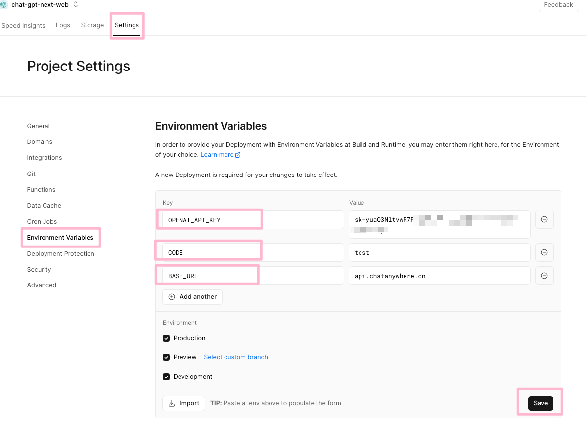

其他环境变量也可以参照 [ChatGPT-NEXT-WEB文档](https://github.com/Yidadaa/ChatGPT-Next-Web/blob/main/README_CN.md#%E7%8E%AF%E5%A2%83%E5%8F%98%E9%87%8F) 自行添加。

#### 2. 重新部署项目
   
根据 Vercel 的文档说明，修改环境变量后需要重新部署使其生效。

点击 `Deployments` 菜单，找到最上面也是最新的部署，点击 `···`，在下拉菜单点击 `Redeploy`，在弹窗中点击 `Redeploy` 按钮。

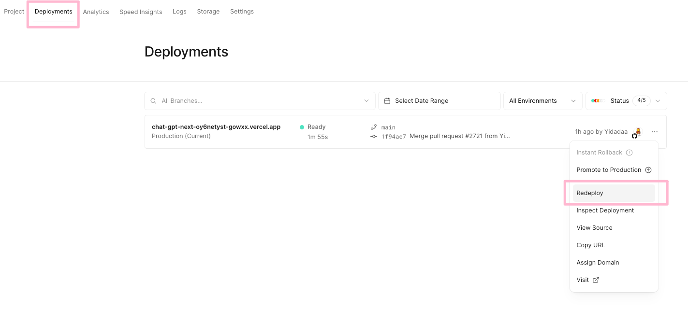

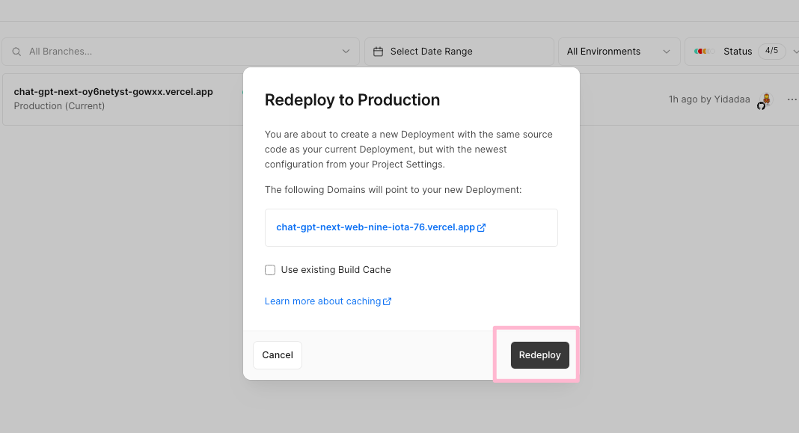

等待部署完成，就可以快乐使用自己部署的 ChatGPT 。

#### 3. 访问 ChatGPT 页面测试

点击域名，访问自己的 ChatGPT 网页。

点击左下角的设置，进到设置页，在 `访问密码` 中填入上一步设置的环境变量 `CODE` 的值，点击右上角关闭设置页。

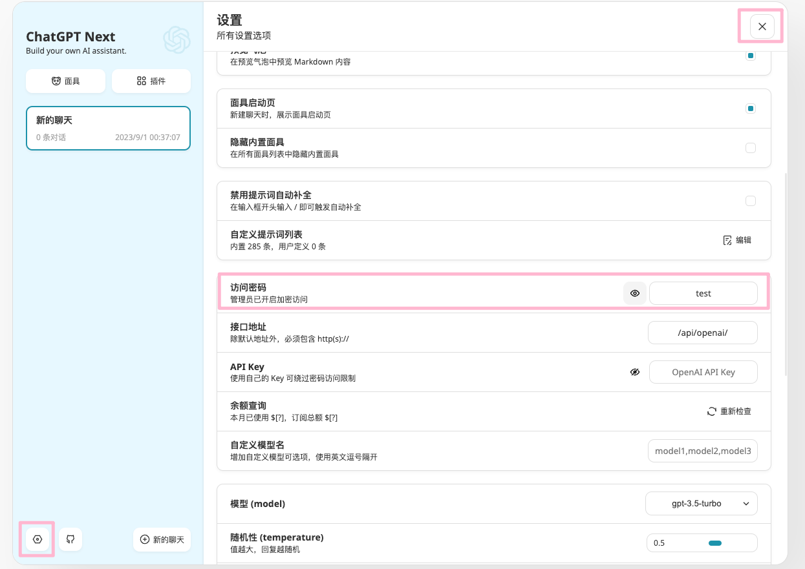

在对话框发送消息测试

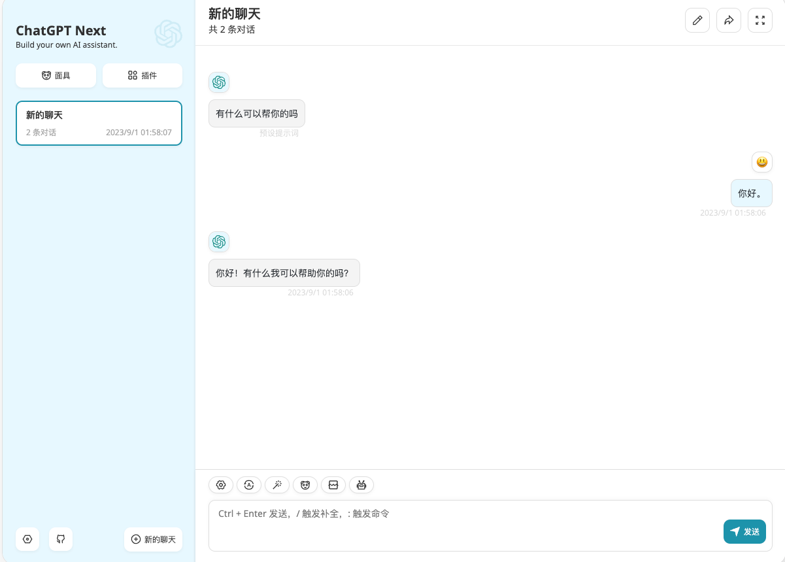

至此已经可以使用 ChatGPT。

#### 4. 配置域名（可选）

我们可以注意到，Vercel 自动生成的域名有一些随机字符，不容易记忆，我们可以在 Vercel 的 项目 dashboard 的 **Settings** 页面，找到 `Domains` 设置，点击 `Edit` 按钮，保持 `******.vercel.app` 的结构，只修改第一段, 例如 `chatgptcccccc.vercel.app`，点击 `Save`。有可能遇到重复的域名，找一个方便自己记忆的也不与别的项目重复的即可。

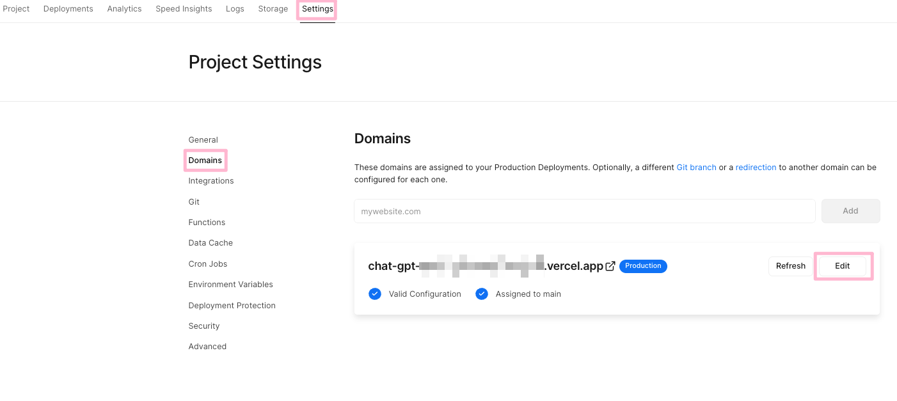

保存成功后，即可用新域名访问项目。

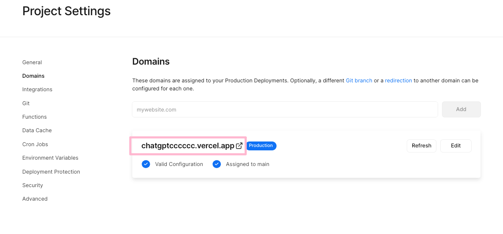

也可以配置自定义域名，具体操作自行阅读 Vercel 文档。

#### 5. 更多使用技巧

阅读 [ChatGPT-Next-Web文档](https://github.com/Yidadaa/ChatGPT-Next-Web/blob/main/README_CN.md#%E4%BF%9D%E6%8C%81%E6%9B%B4%E6%96%B0)

推荐学习下面具的使用方法，预设对话很有用。

模型间的差异自行了解下。

### 五、常见问题及解释

1. 必须设置授权码，并且要设置的复杂一点。
   否则很容易被爆破盗用。
2. 更多部署教程
   阅读 [简体中文 > 如何开始使用](https://github.com/Yidadaa/ChatGPT-Next-Web/blob/main/README_CN.md#%E5%BC%80%E5%A7%8B%E4%BD%BF%E7%94%A8)

3. 项目自动更新失败
   阅读 [简体中文 > 如何保持代码更新](https://github.com/Yidadaa/ChatGPT-Next-Web/blob/main/README_CN.md#%E4%BF%9D%E6%8C%81%E6%9B%B4%E6%96%B0)
4. 更多常见问题
阅读 [简体中文 > 常见问题](https://github.com/Yidadaa/ChatGPT-Next-Web/blob/main/docs/faq-cn.md)

5. 查询 api key 消耗
   可以在 **ChatGPT-Next-Web** 设置页点击查询，如果用的 `peiqi` 的 **转发API** 也可以在 [api.chatanywhere.cn]( https://api.chatanywhere.cn) 输入 `key` 即 `sk-******` 查询。